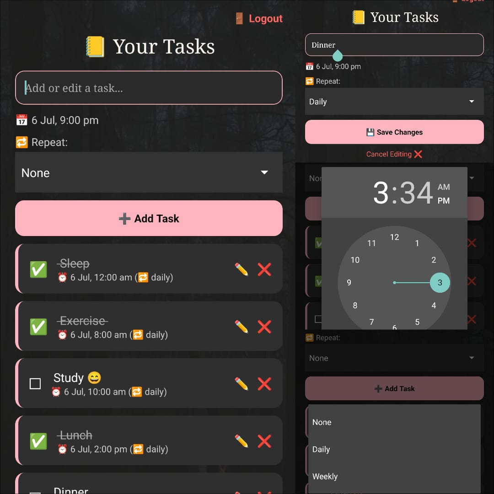

# Smart Task Manager App✨

## 📱 Overview

Smart Task Manager App is a feature-rich mobile productivity application designed to help users efficiently manage their daily tasks, reminders, and recurring events. The app focuses on providing a smooth user experience with a visually appealing, cozy theme and reliable task tracking functionality.

---

## 🔧 Tools & Technologies Used

### Frontend

* **Language**: JavaScript
* **Framework**: React Native via Expo
* **UI Libraries**:

  * `react-native`
  * `expo`
  * `expo-notifications` (for push notifications)

### Backend

* **Firebase** (Backend-as-a-Service):

  * Firebase Authentication (email/password login)
  * Cloud Firestore (per-user task storage)

### Build & Deployment

* **EAS Build** (Expo Application Services)
* **APK Hosting**: Expo.dev Artifacts
* **Version Control**: Git + GitHub

---

## ✅ Key Features

| Feature                     | Description                                          |
| --------------------------- | ---------------------------------------------------- |
| 🔐 User Authentication      | Secure login/sign-up using Firebase Auth             |
| 📝 Task Management          | Add, edit, and delete tasks with full CRUD support   |
| 📅 Due Dates & Reminders    | Set deadlines and configure reminders for tasks      |
| 🔁 Repeating Tasks          | Support for daily and weekly recurring tasks         |
| 🔔 Local Push Notifications | Receive push reminders even when app is closed       |
| ☁️ Cloud Sync               | All data stored securely on Firebase Firestore       |
| 🎨 Aesthetic Design         | Custom vintage-inspired UI and consistent dark theme |
| 📦 APK Build                | Distributed as an APK file for direct installation   |
| 🔐 Persistent Login         | User stays logged in between app sessions            |

---

## 📁 Project Structure

```
├── App.js                # Root component and entry point
├── firebase.js          # Firebase configuration
├── LoginScreen.js       # UI for login and sign-up
├── TaskScreen.js        # Task list, edit, delete, reminders
├── assets/              # Images and icons used in app
├── app.json             # App metadata and configuration
├── eas.json             # EAS build settings
├── android/             # Native Android build (autogenerated)
```

---

## 📸 App

<p align="center">
  
  
</p>
<p align="center">

</p>

---

## 📱 Download the App

You can try out the ZilZzz - Smart Task Manager App:

🔗 [Download ZilZ APK](https://expo.dev/artifacts/eas/fGZowF1EqhCw14vS2tW43a.apk)

> ⚠️ Note: You may need to allow installation from "Unknown Sources" in your Android settings to install the APK.

---

## 📌 Conclusion

This Smart Task Manager App demonstrates a fully functional mobile solution for managing daily tasks with reminders, built using React Native and Firebase. It emphasizes user-friendly design, real-time data management, and practical features like push notifications. The project showcases the integration of multiple technologies to build a real-world, cross-platform application and is a valuable addition to any developer portfolio.

---

## ⭐ If You Like It

Give this repo a ⭐ 

---
